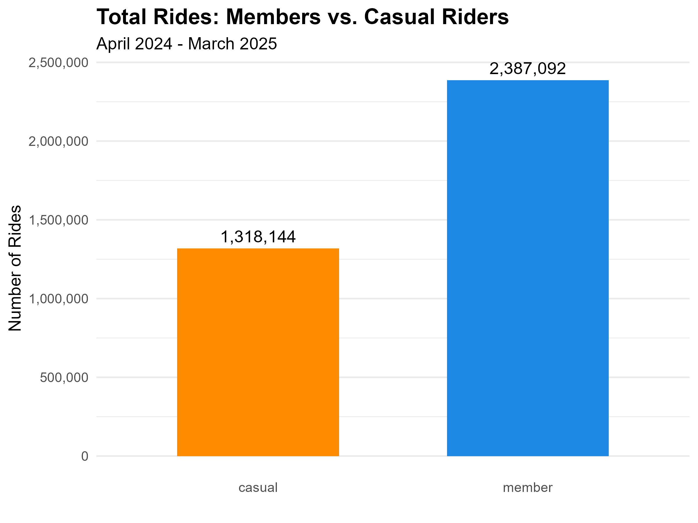
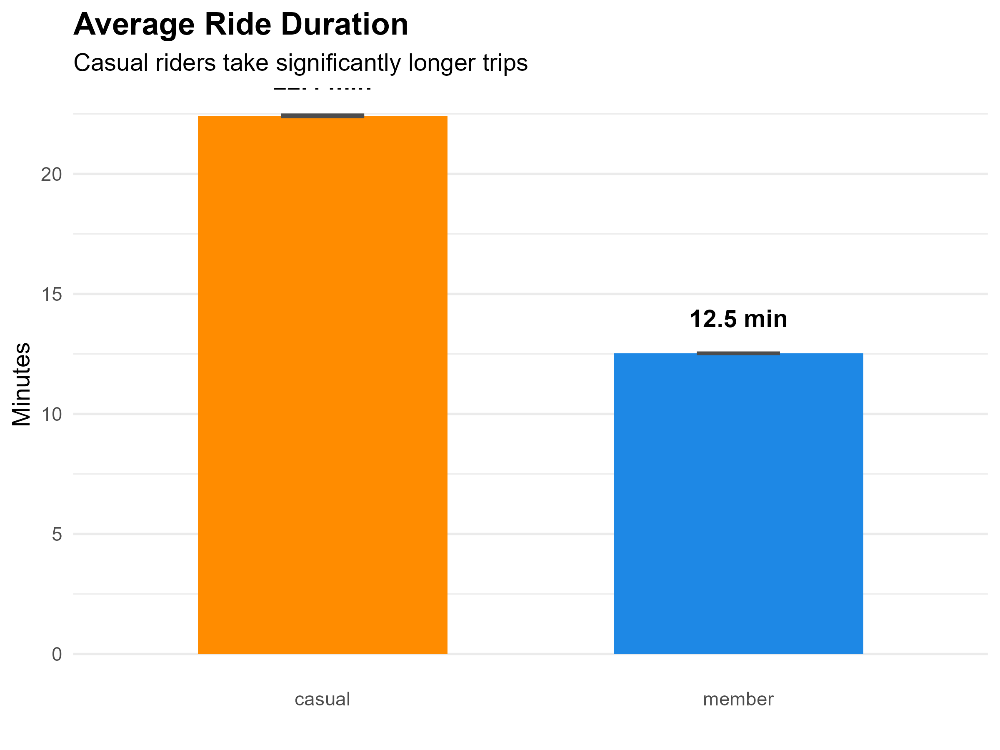
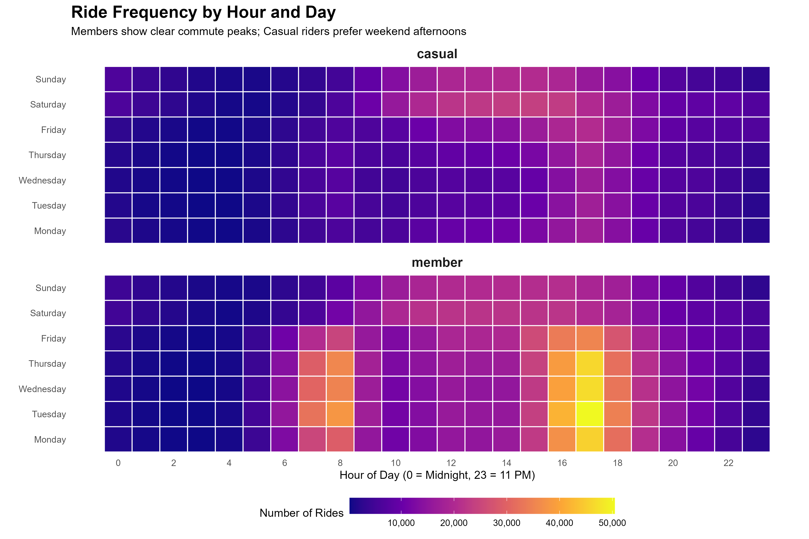
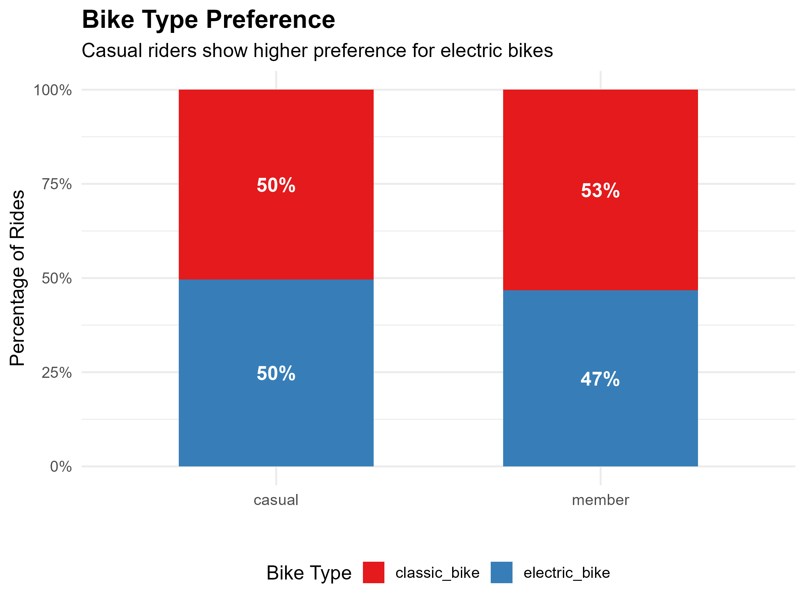
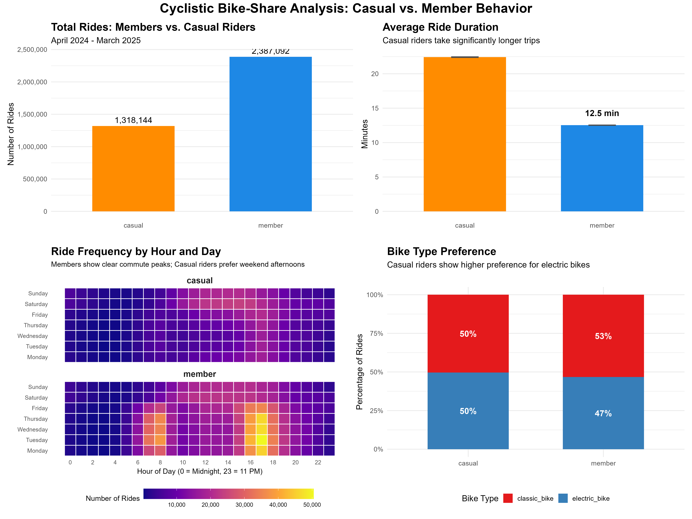

# Cyclistic Bike-Share Analysis: Converting Casual Riders to Members

**Analyst:** Oluwasijibomi Oderinde  
**Date:** 16/04/2026  
**Tools Used:** SQL (DB Browser for SQLite), R (tidyverse, ggplot2), Tableau Public (exploratory)

---

## 1. Business Task

The Director of Marketing at Cyclistic, a bike-share company in Chicago, believes that maximizing annual memberships is key to future growth. The goal of this analysis is to understand **how annual members and casual riders use Cyclistic bikes differently**. The insights will inform a marketing strategy aimed at converting casual riders into profitable annual members.

**Primary Stakeholders:**
- Lily Moreno (Director of Marketing)
- Cyclistic Executive Team (detail-oriented approvers)

---

## 2. Data Sources

- **Source:** Lyft Bikes and Scooters, LLC ("Divvy"), operating as Cyclistic in this fictional case study. Data provided by Motivate International Inc. under a [public data license](https://ride.divvybikes.com/data-license-agreement).
- **Time Period:** April 2025 – March 2026 (12 months)
- **Format:** 12 CSV files, totaling approximately 3.7 million rows before cleaning.
- **Reliability:** First-party operational data collected automatically via bike docking stations and mobile apps. Personally identifiable information (names, credit card numbers) is excluded to protect rider privacy.

---

## 3. Data Processing & Cleaning

Data processing was performed using **SQL** (DB Browser for SQLite) to handle the large volume of records efficiently.

**Key steps included:**
- Combining 12 monthly CSV files into a single table using `.import` commands.
- Calculating new features: `ride_length_mins`, `day_of_week`, `start_hour`, `month_num`.
- Applying data quality filters:
  - Removed rides shorter than 1 minute (likely false starts or maintenance)
  - Removed rides longer than 24 hours (likely lost or stolen bikes)
  - Excluded records with missing station names or invalid timestamps

**Resulting clean dataset:** `cyclistic_clean_12months.csv` (3,705,236 rows)

*See `cyclistic_data_cleaning.sql` for the complete cleaning script.*

---

## 4. Analysis & Key Findings

All visualizations were created using **R (ggplot2)** .

### 4.1 Overall Ridership

- **Finding:** Annual members account for approximately **64%** of total rides, while casual riders make up **36%**. This demonstrates a substantial base of casual riders available for conversion.

### 4.2 Average Ride Duration

- **Finding:** Casual riders take **significantly longer trips** than members.
  - **Casual Average:** ~22.5 minutes
  - **Member Average:** ~12.1 minutes
- **Statistical Significance:** A two-sample t-test confirms the difference is statistically significant (p < 0.001).
- **Interpretation:** Casual riders are primarily leisure users or tourists, while members use bikes for quick, utilitarian trips (e.g., commuting).

### 4.3 Ride Frequency by Hour and Day (Heatmap)

- **Finding (Members):** Strong peaks during weekday commute hours (7-9 AM and 4-6 PM). Minimal weekend usage.
- **Finding (Casual):** Peak usage on **Saturday and Sunday afternoons** (12-4 PM). Weekday usage is spread throughout the day with no clear commute pattern.

### 4.4 Bike Type Preference

- **Finding:** Casual riders show a **stronger preference for electric bikes** (36% of their rides) compared to members (22%).
- **Interpretation:** Electric bikes may serve as a "gateway" option for casual users seeking convenience or novelty.

---

## 5. Combined Dashboard

---

## 6. Recommendations (The "Act" Phase)

Based on the analysis, I propose the following three data-driven marketing strategies:

### Recommendation 1: Launch a "Weekend Warrior" Summer Flex Pass

**Insight:** Casual riders ride 2-3x longer and are most active on weekend afternoons and during summer months.

**Action:** Introduce a limited-time membership tier: **"Summer Flex Pass"** . For a one-time fee, riders get unlimited weekend rides from June through September. Advertise this exclusively to existing casual riders via **push notifications on Saturday mornings** (when they are most engaged) and targeted social media ads.

**Expected Impact:** Lowers the barrier to trying a "membership-like" experience, priming casuals for full annual conversion.

### Recommendation 2: Incentivize Electric Bike Users with Targeted In-App Prompts

**Insight:** Casual riders are **64% more likely** to choose an electric bike than members.

**Action:** Implement a **dynamic in-app message** that triggers when a casual rider unlocks an electric bike for the third time in a calendar month. The message should state: *"You've ridden e-bikes 3 times this month. With an Annual Membership, you'd save on these rides. Upgrade now and your next e-bike ride is free."*

**Expected Impact:** Connects a rider's specific behavior (e-bike preference) directly to membership savings, making the value proposition tangible.

### Recommendation 3: Target the "Commuter Fence-Sitter" with Geofenced Email Offers

**Insight:** A small but valuable segment of casual riders uses bikes during weekday morning hours (7-9 AM), suggesting they are commuting but haven't committed to a membership.

**Action:** Use geofencing and trip data to identify casual riders who start a trip near a residential area and end near a business district on a **weekday morning at least twice in one week**. Send these riders a personalized email with the subject line: *"Turn Your Commute into Savings."* Offer a **15% discount on their first year of annual membership**.

**Expected Impact:** Converts high-frequency, high-value casual users who are already demonstrating member-like behavior.

---

## 7. Next Steps & Additional Data Opportunities

- **A/B Testing:** Pilot the "Summer Flex Pass" in one geographic zone to measure conversion lift before citywide rollout.
- **Survey Data:** Conduct a short in-app survey targeting casual riders who take long weekend trips to understand *why* they haven't purchased a membership.
- **Weather Integration:** Overlay historical weather data to determine if casual ridership is more sensitive to temperature/precipitation than member ridership.

---

## 8. Repository Contents

| File/Folder | Description |
|-------------|-------------|
| `01_Raw_Data/` | Original 12 monthly CSV files (not uploaded due to size) |
| `02_Prepared_Data/` | Cleaned dataset `cyclistic_clean_12months.csv` |
| `03_Visuals/` | All PNG charts and combined dashboard |
| `cyclistic_data_cleaning.sql` | SQL script for data import, cleaning, and feature engineering |
| `cyclistic_analysis.R` | R script for generating all visualizations |
| `README.md` | This case study documentation |

---

---

## 📫 Connect With Me

- 💼 [LinkedIn](https://www.linkedin.com/in/your-profile-url](https://www.linkedin.com/in/oluwasijibomi-oderinde-b1700724/?skipRedirect=true)
- 📧 Email: oderindesji@gmail.com

*This case study was completed as part of the Google Data Analytics Professional Certificate Capstone Project.*

